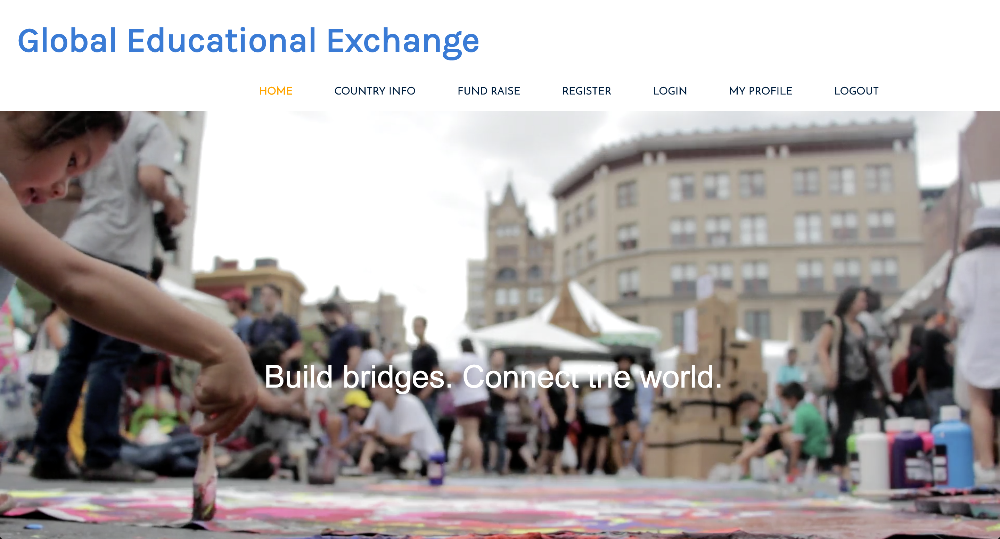

# Global Educational Exchange



View web app on Heroku here: 
https://still-tundra-38582.herokuapp.com/

## What is Global Educational Exchange?

Global Educational Exchange is a non profit organization that is dedicated to connecting students in classrooms with dedicated volunteers from around the world. We strive to educate young minds with the intent of increasing cultural awareness and fostering a community where everyone belongs.

## Technical Discussion

* HTML
* CSS
* JavaScript
* jQuery
* Express

### Inspiration Behind Global Educational Exchange  

After spending a study abroad semester in Spain during the Spring of 2014, I wanted to continue to travel and gain a better understanding of the Spanish-speaking world. When I graduated in 2015 with a BS in Management & Business, I decided to put my learning experience in the classroom to use. I spent several months volunteering for the Salvation Army before heading to Colombia for a teach-abroad opportunity. While serving as a volunteer English co-teacher, I noticed the passion and inspiration that my students demonstrated while learning English as their foreign language due to my presence as a foreigner from New York City. I am determine to bring that same passion and inspiration to students in American under-privilege  foreign language classrooms through the help of dedicated volunteers from abroad.  

### Sample Code

```
<% for (let globals of data) { %>
    <div class='globals-data-container'>
        <div class='submit-container'>
            <div class='globals-title'>
                <h1><%= globals.title %></h1>
            </div>
            <div class='globals-cost'>
                <h1><%= globals.cost %></h1>
            </div>
            <div class='globals-category'>
                <h1><%= globals.category %></h1>
            </div>
            <div class='globals-description'>
                <h1><%= globals.description %></h1>
            </div>
            <div class='globals-deadline'>
                <h1><%= globals.deadline %></h1>
            </div>
        </div>

        <div class='buttons'>
            <form method='POST' action='/globals/<%= globals.id %>?_method=DELETE' class='delete-button'>
                <input type='submit' value='Delete' />
            </form>
            <form method='GET' action='/globals/<%= globals.id %>/?_method=POST' class='edit-button'>
                <input type='submit' value='Edit' />
            </form>
        </div> 
       
    </div>
```
## The Making of Global Educational Exchange

Credits: 
* https://www.coverr.co 
* Special thanks to Hao Sun and Mark Ma for their incredible debugging skills
* UX students from the 4th floor who gave me feedback about my design and layout of web app

## Opportunities for Future Growth

I want to revamp the navigation bar by combining the register, login, and my profile tabs into one tab. I also want to be able to incorporate an About Me, Donation, and several other features into the navigation bar. In addition I also want to improve my fund-raising table and make it more visually appealing for users. 


